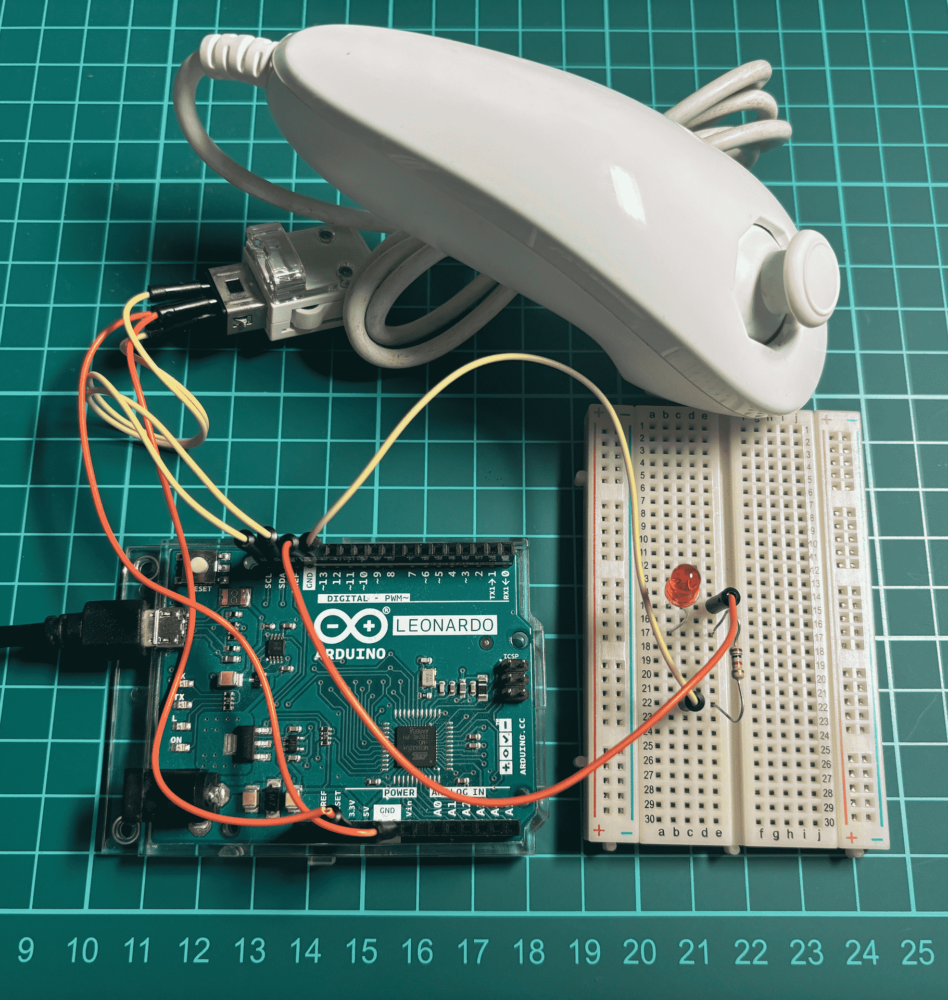
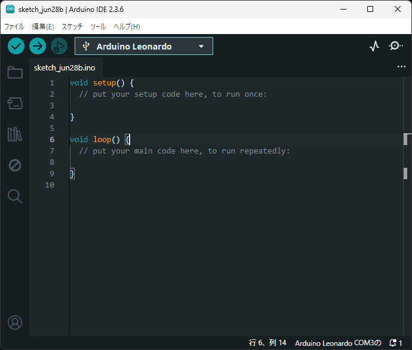
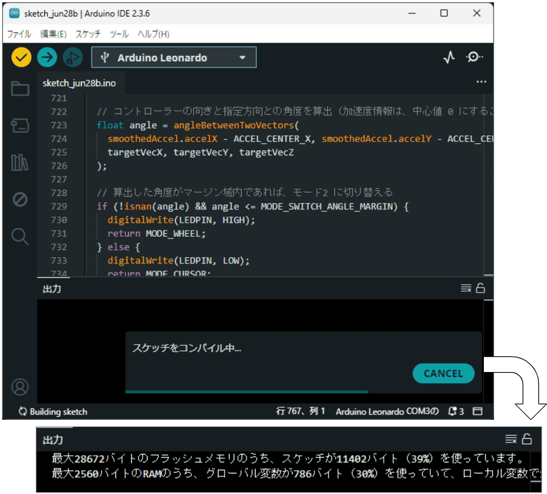
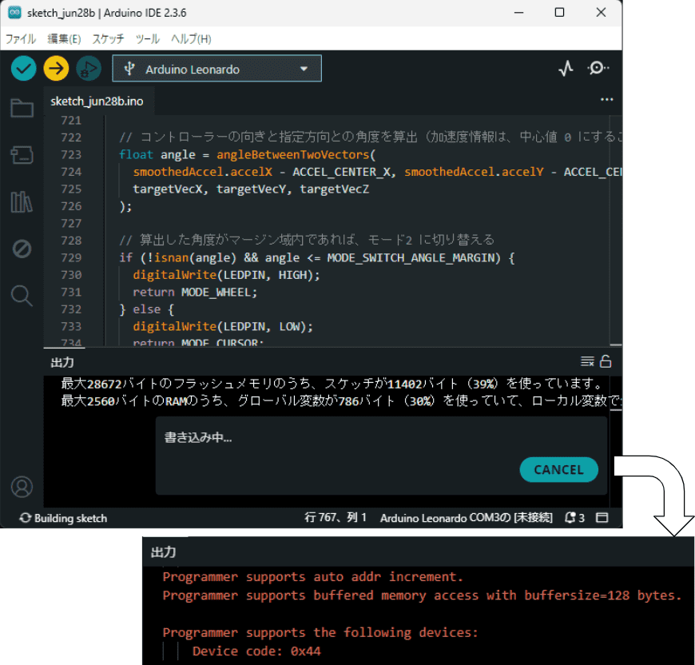
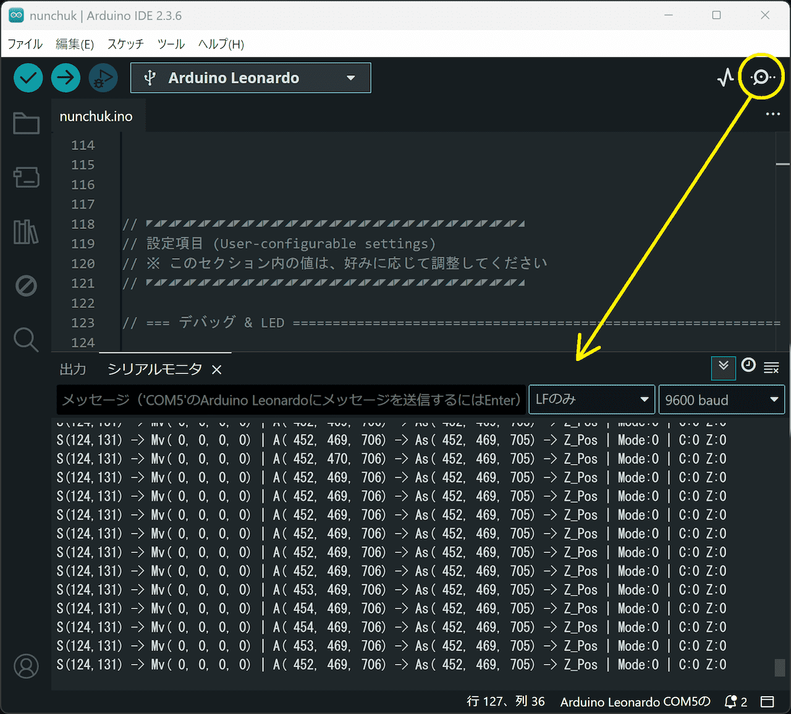
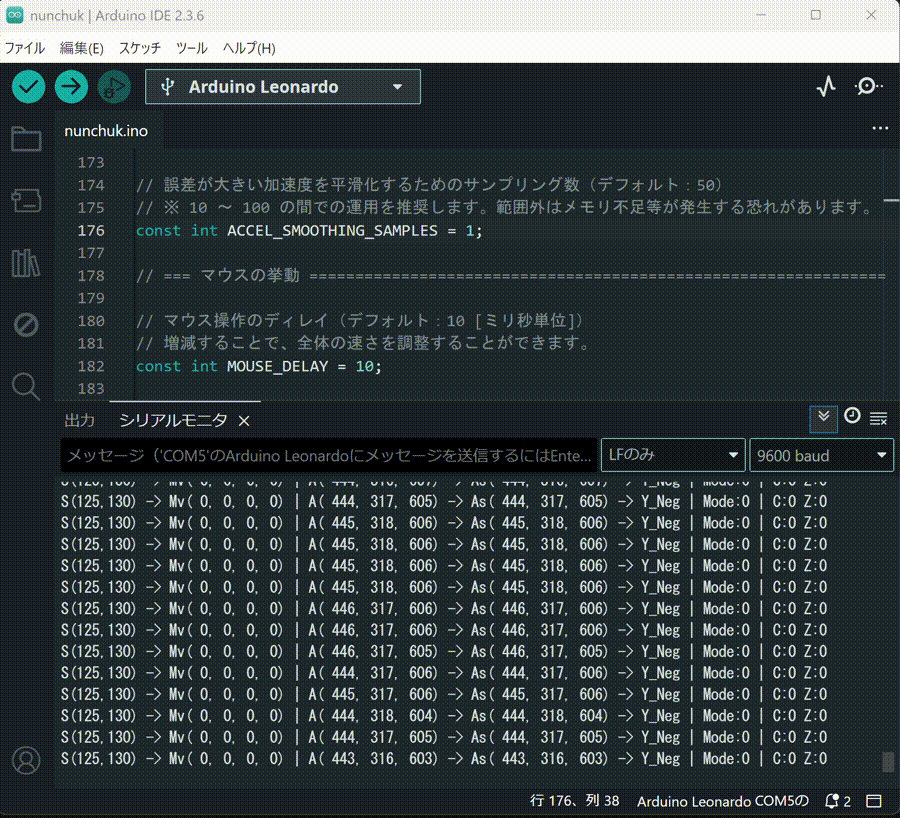
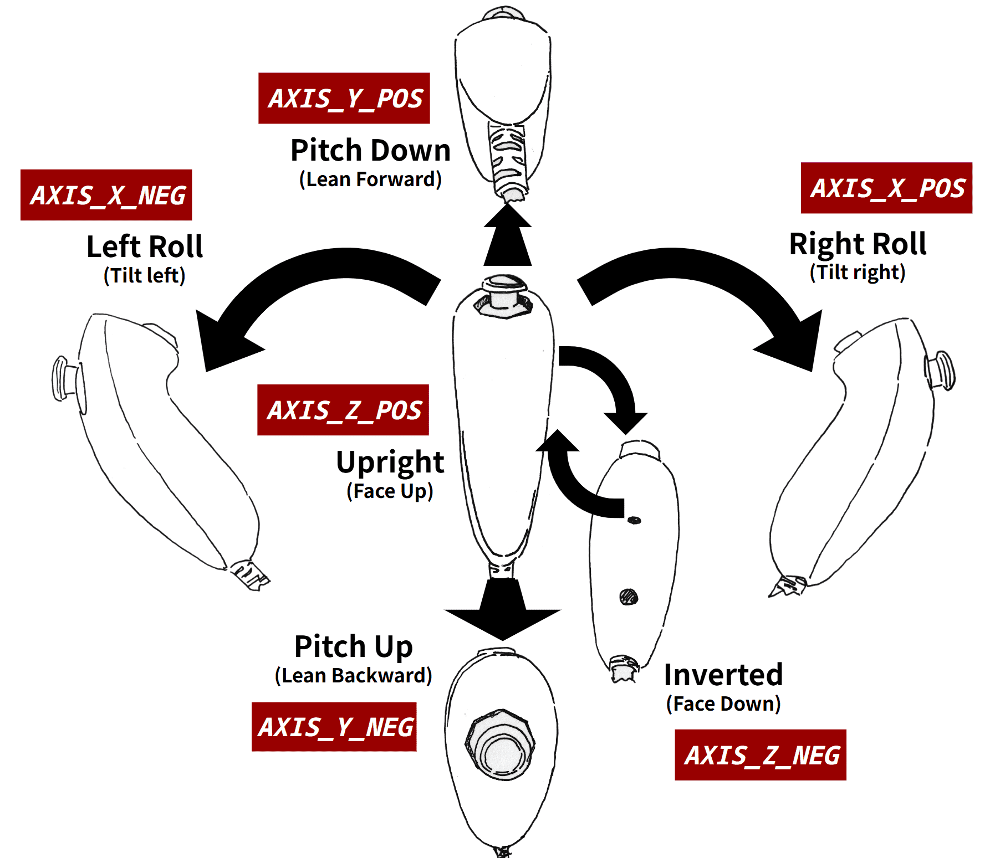

# Nunchuk-Mouse for Arduino

本リポジトリは、Wii ヌンチャクコントローラーを Arduino を介して PC 上でマウスとして機能させるためのものとなります。

なお、本リポジトリに関する備忘録を [Zenn](https://zenn.dev/nonaka101/books/nunchuk-mouse) にて公開しています。よろしければこちらも ご参照ください。

## 概要

本リポジトリのメリットは、下記の通りです。

1. [環境や状況に縛られないマウス操作が可能](#環境や状況に縛られないマウス操作)
2. [入手性とカスタマイズ性](#入手性とカスタマイズ性)
3. [学習用の教材として](#学習用の教材として)

### 環境や状況に縛られないマウス操作

#### 姿勢の自由度

臥位、座位、立位に関わらず、自由な姿勢で操作することができます。

ベッド上から、ソファに腰掛けた状態から、プレゼンで立った状態から など、様々な状況・姿勢でも直感的に PC を操作することができます。

#### 最小限の動作でマウス機能にアクセス可能

手や体の動きを最小限に抑えた上で、5 ボタンマウス同等の機能にアクセスすることが可能です。

通常のマウスでは、マウスカーソルの移動などで上肢全体を使います。

本リポジトリでは、指（スティック, ボタン）と手首の傾き（モード切替）だけで完結できるよう設計しています。最小限の動作で、一般的な 5 ボタンマウスが提供する下記操作が可能です。

- カーソル移動
- ホイールスクロール
- マウスボタン（左右中）
- 戻る/進む ボタン

機能を手指に集中しているため ある程度の巧緻性は必要となってきますが、OS 側のアクセシビリティ設定や後述する[カスタマイズ](#カスタマイズ性)により、一部を緩和することができるかもしれません。

#### 様々なOSで動作可能

HID (Human Interface Device) として認識するので、専用ソフトのインストール等は不要です。USB ケーブルで PC と Arduino を繋ぐだけで、コントローラーをマウスとして動かすことができます。

HID をサポートしている一般的な OS（Windows, Linux, Mac[^1] など）であれば、動作可能と考えて OK です。

[^1]: MacOS に関してはコード内にある設定項目の変更（カスタマイズ）が必要です。これは「戻る/進む」ショートカットキーが他の OS と異なるためです。

### 入手性とカスタマイズ性

#### 入手性

見栄えを気にしなければ、下記のみで動かすことができます。

- Arduino などの開発ボード（**注意**[^2] [^3] [^4]）
- Wii ヌンチャク（コントローラー）
- USB ケーブル
- 4 本のジャンプワイヤ

[^2]: Arduino 開発ボードは HID サポートされた機種が必要となります。詳しくは[公式ドキュメント](https://docs.arduino.cc/language-reference/en/functions/usb/Keyboard/#compatible-hardware)を参照ください。
[^3]: 互換品である Pro Micro 等でも動作するとは思いますが、検証はしていない状態です。ご了承ください。
[^4]: コントローラーの電源が 3.3V のため、3.3V を出力できるボードを推奨します。

これらは中古で比較的安価に手に入るため、気軽に試してみたり、後述する[学習用教材として](#学習用の教材として)利用しやすいと考えられます。

#### カスタマイズ性

様々な状況を想定し、ユーザーに合った使い心地にできるよう、様々な設定項目を設けています。下記はその一例です。

- スティックや加速度センサーの各種調整
  - 中心軸
  - 可動範囲
  - 平滑処理に使うサンプリング数
- `C`, `Z` ボタンのマウス機能割当
- モード切替条件となる向きや精度
- カーソルやホイールの移動量
- 逆スクロールのオン/オフ

こうした設定を調整することで、ユーザーごとに異なる 姿勢や利き手といった事情に対応し、自身の好みに合わせたカスタマイズをすることができます。

また HID として OS 上は認識されるので、OS 側の設定（マウスやアクセシビリティなど）と組み合わせることで より利便性を上げることができるかもしれません。

### 学習用の教材として

本リポジトリは、Arduino 初心者が作成したものになります。そのため同じような方には、学習教材としても利用できるかもしれません。

コードの中では、下記の内容を取り扱っています。

- I2C 通信を使って、センサー等から情報を取得する
- データを扱いやすい形に処理する（平滑化、オフセット）
- 扱うデータを構造体にまとめる
- 加速度情報からデバイス向きを算出する
- 少ない物理機能に対し、状態管理（モード切替）で割当数を増やす

#### 更なる改良

コードは開発した状態のままにしてあります。効率のための軽量化等は行っておらず、コメント等は開発時のままにしています。

また、更なる機能追加ができるよう設計を考えているので、これをベースとして更なる改良を行うこともできるかもしれません。

例：ジェスチャー機能（「素早く振る」といった動作）を使って、特定のショートカットに割り当てる

## 操作方法

ここでは PC に接続した際の操作方法を説明します。PC 接続までについては、後述しておりますのでそちらを参照ください。

### 2つのモードによる機能切替

コントローラーの物理機能（スティック、ボタン、加速度）を使い、5 ボタンマウスと同等の機能を提供します。

物理機能の少なさを解消するために、コントローラーに搭載された加速度センサーを利用します。特定の向き（デフォルトでは *Pitch Up*）でモードを切り替えることで、1 つの物理機能に複数のマウス機能を振り分けています。


#### モード１：カーソルモード

通常の持ち方ではカーソルモードとなります。

##### スティックでカーソル移動

カーソルモード時は、スティック操作でカーソル移動できます。

##### 2つの物理ボタンでマウスボタン操作

（デフォルト設定では）C ボタンはマウス左ボタン、Z ボタンはマウス右ボタンとして機能します。マウスボタンは一般のマウス同様、ダブルクリックやドラッグ操作が可能です。

#### モード２：ホイールモード

特定の向き（デフォルトでは *Pitch Up*）でホイールモードに移行し、各種物理機能の役割が変わります。

##### スティックでホイール移動および戻る/進むボタン

ホイールモードでは、スティックはホイール移動と「戻る」「進む」ボタンとして機能します。

- スティック上下でホイール移動
- スティック左右で「戻る」「進む」

##### 異なるマウスボタン

（デフォルト設定では）C ボタンはマウス左ボタン、Z ボタンはマウス中ボタンとして機能します。

#### LEDで状態を通知

通常 Arduinoは、自由に使える LED が内蔵（オンボード）されています。

> [!NOTE]
> Arduino 純正ボード外（例：Pro Micro）を使用する場合や、オンボードでない LED を使用したい場合には、設定でピン番号を切り替える作業が必要かもしれません。

この LED を使い、下記のモードや状態を通知します。

##### ホイールモード時は点灯

ホイールモード（特定の向きにデバイスを向けた状態）では、モードが切り替わったことを知らせるために **LED が点灯**します。

##### エラー時は点滅

何かしらのエラーなどでコントローラーとの接続ができなくなると、**LED が 点滅**します。

## 必要となる機材等

ここでは、コントローラー（Wiiヌンチャク）をマウスとして機能させるために必要となる機材について説明します。

下図は開発段階の検証機ですが、このような簡素な構成でも動かすことができます。



### Arduino IDE

ボードにコードを書き込むための IDE[^5] を PC にインストールしてください。

IDE は [公式ホームページ](https://www.arduino.cc/en/software/)から取得することが可能です。導入に関しての詳細は、公式サイトを参照ください。

[^5]: IDE（Integrated Development Environment）：統合開発環境、必要となる様々な機能をまとめた開発環境のこと

### Arduinoなどの開発ボード

コードを記録し処理するための開発ボードが必要となります。

開発ボードに必要な要件としては、Arduino IDE を使ってコードを書き込めることの他に、下記の条件を満たす必要があります。

- 必須：HID 対応
- 推奨：3.3V を出力可能

本リポジトリの開発・検証にあたっては、[Arduino Leonardo](https://docs.arduino.cc/hardware/leonardo/) を使用しています。

> [!TIP]
> コントローラー内部に埋め込む場合は、Leonardo より省サイズでなければなりません。私が行なった検証では、[Adafruit 社 ItsyBitsy 32u4](https://www.adafruit.com/product/3675)（3V 8MHz 版）を使用しました。
>
> ただし互換品の利用となるため、少し手順が異なってきます。この機材を使う場合は、公式提供の[Introducing ItsyBitsy 32u4](https://learn.adafruit.com/introducting-itsy-bitsy-32u4)を参照してください。

#### 必須：HID 対応

本リポジトリでは マウス機能を使うために、HID[^6] 機能をサポートしたハードウェア（開発ボード）が必要です。

[^6]: HID（Human Interface Device）：コンピューター用デバイスで人が入力する際に使うもの。マウスやキーボードなどが、これに該当する。

公式ドキュメントで、サポートしているボード一覧を確認することができます。

> HID is supported on the following boards:
>
> - Leonardo
> - Micro
> - Due
> - Zero
> - UNO R4 Minima
> - UNO R4 WiFi
> - GIGA R1 WiFi
> - Nano ESP32
> - MKR Family
>
> 『[Mouse | Arduino Documentation](https://docs.arduino.cc/language-reference/en/functions/usb/Mouse/)』より一部抜粋

#### 推奨：3.3Vを出力可能

> [!CAUTION]
> 5V だと、機材への過負荷等の問題が考えられるため非推奨です。

コントローラーの電源は 3.3V となっています。そのため 3.3V を出力できるピンがついているのが望ましいです。

> [!NOTE]
> 開発ボードが 5V の場合、レベルコンバーター[^7]を介する方法で対処が可能かもしれません。ただしそこまで検証できていない状態です。

[^7]: レベルコンバーター：3.3V と 5V といった異なる信号の電圧を変換して通信を適正に保つためのモジュールの一種。

### ヌンチャクコントローラー

Wii ヌンチャクを 1 つ準備してください。

製造時期により「シロ」「クロ」の 2 種ありますが、設定で両方対応できるようにしています

> [!NOTE]
> 作成に当たってはシロを使っており、クロは入手できていないため検証ができていない状態です。

### 配線

単純に動作を確認するだけなら、**ジャンプ ワイヤー 4本** と **USB ケーブル**（Arduino を PC に接続するためのもの）で動かすことが可能です。

綺麗に使いたい場合は、ケーブルを分解して配線し直したり、市販のアダプターを使ったりしてください。

## 機器の接続①

ここでは、PCと接続する前段階として、コントローラーとArduinoの接続方法を説明します。

なお ここではジャンプワイヤ 4 本を使った、最も簡素な接続方法を想定しています。

### Arduino 側の配線

コントローラーとの通信には、I2C[^8] を使います。関係としては、Arduino ボード側がマスター、コントローラー側がスレーブとなります。

[^8]: I2C（Inter-Integrated Circuit）：データ通信の 1 種で、信号線 2 本を用いたシリアル通信を指す。安価でありつつ、ある程度高速な通信速度と精度を持ち、さらにバス通信も可能と、コストパフォーマンスに優れているとされている。

まずは、Arduino 側の配線を行います。ここでは、ワイヤを開発ボードの 4 箇所に繋ぎます。

下図は Arduino Leonardo のものなので、違うボードを利用している場合は、配線横に記載したピン場所を参考に接続してください。


信号線としての 2 本（`SDA`[^9], `SCL`[^10]）と、電源としての 2 本（`3,3V`, `GND`）の計 4 本で、コントローラーとの通信を行います。

[^9]: SDA（Serial Data）：データ本体をやり取りするための信号線
[^10]: SCL（Serial Clock）：一定周期で切り替わるクロック線。ここでのタイミングとSDAを組み合わせることで、`0`, `1` のデータに変換される

### コントローラー側の配線

次に、[先程 配線した 4 本](#arduino-側の配線)を、コントローラーに繋ぎます。

ここでの接続方法に関しては、端子を分解し剥いてきたケーブルを直接はんだ付けしたり、市販されているアダプタを使う等 様々です。

単純に検証するだけなら、下図のように直接ワイヤと接続端子を繋げれば OK です。


これで、Arduino とコントローラー間の配線は完了です。

## 機器の接続②

前節にて、コントローラーと Arduino の接続ができました。ここからは Arduino と PC を接続する作業を説明していきます。

### Arduino IDE を起動

接続する前にまず、[公式ホームページ](https://www.arduino.cc/en/software/)等からインストールした Arduino IDE を起動させます。

### Arduino を PC に接続

IDEが立ち上がったら、USBケーブルを使い Arduino と PC を接続します。

IDE 上でボードが認識されたことを確認してください。



> [!TIP]
> 自動的に認識されない場合、「ツール」→「ボード」から対応するボードを選択します。
>
> 純正でない互換ボードの場合は、下記の作業が必要かもしれません。詳しくはお使いのボードの説明書等を参照してください。
>
> 1. 「Arduino」→「Preferences...」から、ボードマネージャーで互換ボードを扱うための URL を追加
> 2. 「ツール」→「ボード」→「ボードマネージャー」から、対応するボードを選択

### スケッチを作成

リポジトリにある `nunchuk-mouse.ino` をボードに書き込みます。

ファイルをダウンロードして IDE で開いてもいいですし、コード文をコピーして IDE 上の新規スケッチにペーストしても構いません。

### 検証と書き込み

ボードに書き込む前に、一度コンパイルを通して問題ないかを検証しておきます。`✓` ボタンで *Verify*（確認する）です。



問題がなければ、ボードに書き込みを指示します。`→` ボタンで *Upload*（書き込み）です。



### 問題がなければマウスとして機能

ボードに書き込みが終わったら、コントローラーをマウスとして使えるようになります（起動に数秒程度かかる場合があります）

ここからは、動作に問題がないかを確認していきます。

> [!IMPORTANT]
> ここからは持ち方によってモードが切り替わるので注意してください。
>
> |モード名|持ち方|識別方法（ボード上の LED）|
> |:---|:---|:---|
> |**カーソルモード**|通常時の状態です。ホイールモードの持ち方以外で、このモードになります|消灯|
> |**ホイールモード**|デフォルト設定では、コントローラーを立てる（下図の *Pitch Up*）状態で、このモードになります|点灯|


> [!NOTE]
> しばらく待ってもコントローラーが反応せず、**ボード上の LED が点滅状態**にある場合、**接続エラー**が起きています。その際は下記を確認してください。
>
> - 配線やコードが間違っていないか
> - コントローラーやボードは適正なものを使用しているか

#### カーソルモード

カーソルモード（通常時の持ち方：スティックが天井方向を向いている状態）での各種機能を確認していきます。

##### カーソル移動

スティックを傾けると、マウスカーソルが連動して移動します。

##### マウス左右ボタン

C ボタンでマウス左ボタン、Z ボタンでマウス右ボタンとして機能します。押す長さにより、ダブルクリックやドラッグ操作も可能です。

#### ホイールモード

ホイールモード（デフォルトの設定では**コントローラーを立てる**：物理ボタンが天井方向を向いた状態）での各種機能を確認していきます。

##### ホイール移動

スティックの上下が、ホイール移動として機能します。

##### 戻る/進む機能

スティックの左右で、ブラウザ等の「戻る」「進む」機能を利用できます。

##### マウス左中ボタン

C ボタンでマウス左ボタン、Z ボタンでマウス中ボタンとして機能します。押す長さにより、ダブルクリックやドラッグ操作も可能です。

## 調整について

ここでは デフォルト設定から自身に合わせた調整を行なっていく方法について説明します。

コード内にある設定項目を書き換えることで、コントローラーの個体差を補正したり、より自身にあった形に調整することができます。

任意での作業なので、使いづらい場合に ご利用ください。

### 調整手順

ここでは、調整手順の 1 例を示します。

#### デバッグモードを有効化する

まずはコントローラーの個体差がないかを確認するために、デバッグモードを有効化します。

デバッグモードを有効化するには、コード内にある設定項目「[デバッグ及びLED](#デバッグ及びled)」内にある `ENABLE_DEBUG_MODE` の値を `true` に書き換えます。


その状態で Arduino に書き込むと、**コントローラーがマウスとして機能しなくなる**代わりに**各種情報をシリアルモニタ上に出力**するようになります。

出力内容を確認するためには、IDE 画面右上にある「シリアルモニタ」をクリックします。すると下図のように、各種情報を確認できるようになります。



#### シリアルモニタに各種情報を出力する


上図はシリアルモニタの経過を映したものです。これは 1 回で行う処理の計測値（下記参照）を、秒間あたり複数回出力している状態です。

```txt:1行が1回の出力内容となる
S(128,186) -> Mv(-1, 5, 1, 0) | A( 532, 320, 724) -> As( 524, 323, 723) -> X_POS | Mode:0 | C:1 Z:0
```

`S` や `A` といった 各要素の意味については、下表を参照してください。

|名前|説明|備考|
|:---|:---|:---|
|`S`|スティック(*Stick*)入力値、形式は `(x, y)`|中心値はおおよそ 128|
|`Mv`|スティック入力値を各種マウス機能(*Move*)に変換したもの、形式は `(カーソル X, カーソル Y, ホイール W, ショートカット S)`||
|`A`|加速度情報(*Accel*)、形式は `(x, y, z)`|中心値はおおよそ 512|
|`As`|平滑化処理を施した加速度情報(*AccelSmoothed*)、形式は `(x, y, z)`|通常の加速度情報に比べ、計測誤差のブレ幅が小さいことが確認できる|
|`X_POS`|デバイス向きを 5 文字で表現|最初の 1 文字が `軸`、後ろ 3 文字が`±` を表す|
|`Mode`|傾きによるモード判定|`0` がカーソルモード、`1` がホイールモード|
|`C`|C ボタンの状態|`0` が解放、`1` が押下状態|
|`Z`|Z ボタンの状態|`0` が解放、`1` が押下状態|

ここではコントローラーの補正に使うため、スティックの情報を控えておきます。

> [!TIP]
> 加速度情報を控えておき、補正することも可能ではありますが原則は不要です。詳しくは[各種設定項目](#各種設定項目)の `ACCEL_CENTER_*` を参照ください。

#### スティック情報を控えておく

スティックに関する下記の情報を控えておきます。

- 何も触れてない状態の値を調べる（これがスティック中心値となります）
- スティックに触れずにコントローラーを揺らし、値が変化しないか確認する
  - 変化する場合は、その変動幅を調べる（これが遊び範囲となります）
- スティックを傾け、入力可能な範囲を調べる（これが可動範囲となります）

#### 出力内容を基に補正

上記内容を基に、コードの中にある設定項目を編集します。編集する項目は下表のとおりです。

|情報|対応する設定項目|
|:---|:---|
|スティック中心軸|`STICK_CENTER_*`(`X`, `Y`)|
|スティック遊び範囲|`STICK_DEADZONE_*`(`X`, `Y`)|
|スティック可動範囲|`STICK_RANGE_*`(`X`, `Y`)|

#### その他調整を施す

[各種設定項目](#各種設定項目)にある内容のうち、必要となる箇所を調整します。

最終的にデバッグモード（`ENABLE_DEBUG_MODE`）を無効（`false`）にし、ボードに書き込んだら調整は完了です。

## 各種設定項目

本段落では、各種設定項目と その内容について個別に見ていきます。

### デバッグ及びLED

ここではデバッグに関する設定を行います。

#### `ENABLE_DEBUG_MODE`

```cpp
// デバッグモードを有効化する（デフォルト：false）
// ※ デバッグ時は、IDE シリアルモニター上に状態を出力します
const bool ENABLE_DEBUG_MODE = false;
```

デバッグモードを有効化する場合に、`true` に設定します。

デバッグモードを有効化して Arduino に書き込むと、マウスとしては機能しなくなる代わりに各種情報をシリアルモニタを通じて出力することができます。


#### `ENABLE_LED`

```cpp
// 状態を可視化するため LED を使用する（デフォルト：true）
// ※ 点灯はホイールモード、点滅は接続エラーを示します
const bool ENABLE_LED = true;
```

状態を知らせるために LED を利用する場合に有効化します。

デフォルトの状態は、オンボードの LED（ピン番号 13）を使い状態を知らせます。点灯がホイールモード、点滅が接続エラーを意味します。

##### `LEDPIN`

```cpp
// 使用する LED ピン番号（デフォルト：13）
// ※ ENABLE_LED 有効時に使用します。デフォルトの 13 は、Arduino のオンボード LED です。
const int LEDPIN = 13;
```

状態を知らせるために使う LED のピン番号を指定します。`ENABLE_LED` が有効時のみ利用します。

### デバイス関係

ここでは使用する機器に関する設定を行います。

#### `IS_NUNCHUK_SHIRO`

```cpp
// ヌンチャク種別、クロの場合は false に変更（デフォルト：true）
const bool IS_NUNCHUK_SHIRO = true;
```

使用するコントローラーが「クロ」である場合に、`false` を設定します。

これはコントローラーは製造時期によって「シロ」「クロ」と分かれており、それぞれで初期化するための処理が異なっているためです。

#### `IS_MACINTOSH`

```cpp
// Macintosh の場合は true に変更（デフォルト：false）
const bool IS_MACINTOSH = false;
```

Arduino を接続する PC が Mac である場合に、`true` を設定します。

これは「進む」「戻る」ショートカットキーが、Windows や Linux 系が `Alt` + `←`（または `→`）であるのに対し、Mac では `Command` + `[`（または `]`）と異なるためです。

### ヌンチャク物理特性のデフォルト値

ここではコントローラーの物理機能に関する設定を行い、補正を施します。

#### `STICK_CENTER_*`（`X`, `Y`）

```cpp
 // スティック X 軸の中心値（デフォルト：128）
const int STICK_CENTER_X = 128;

// スティック Y 軸の中心値（デフォルト：128）
const int STICK_CENTER_Y = 128;
```

スティック入力の中心値を設定します。

想定ではスティック入力の中心値は 128 ですが、製品としての個体差等でズレることが考えられます。この設定は そうしたズレを補正するためにあります。

デフォルトの `128` は、スティック入力の中心値が 128 であることを示しています。

#### `STICK_DEADZONE_*`（`X`, `Y`）

```cpp
// スティック X 軸の遊び範囲（デフォルト：10）
const int STICK_DEADZONE_X = 10;

// スティック Y 軸の遊び範囲（デフォルト：10）
const int STICK_DEADZONE_Y = 10;
```

スティック入力の遊び範囲を設定します。

コントローラーによってはスティックが経年劣化し、触れていなくてもスティック値が微小に変化する場合があります。この設定は、このような意図せぬ微小な変化をマウスに伝達しないよう、スティックの遊び範囲を設けるためにあります。

デフォルトの `10` は、中心値からプラスマイナス 10 を遊び範囲とし、スティック入力値がこの範囲内である場合は「入力なし」と みなします。  
（例：中心値 `128` と仮定した場合、`118` 〜 `138`）

#### `STICK_RANGE_*`（`X`, `Y`）

```cpp
// スティック X 軸の可動範囲（デフォルト：90）
const int STICK_RANGE_X = 90;

// スティック Y 軸の可動範囲（デフォルト：90）
const int STICK_RANGE_Y = 90;
```

スティックで入力可能な範囲を設定します。

デバッグモードでのスティック入力値を確認すると、おおよそ `128` 中心で、大きく傾けても `0` や `256` にならないことがわかります。この設定は入力可能な範囲を設定し、それに合わせてカーソル移動量を規定するためにあります。

デフォルトの `90` は、中心値からプラスマイナス 90 の範囲で変動することを示します。  
（例：中心値 `128` と仮定した場合、`38` 〜 `218`）

#### `ACCEL_CENTER_*`（`X`, `Y`, `Z`）

```cpp
// 加速度 X 軸の中心値（デフォルト：512）
const int ACCEL_CENTER_X = 512;

// 加速度 Y 軸の中心値（デフォルト：512）
const int ACCEL_CENTER_Y = 512;

// 加速度 Z 軸の中心値（デフォルト：512）
const int ACCEL_CENTER_Z = 512;
```

加速度センサーの中心値を調整します。デバイスの計測誤差が大きいときにのみ調整してください。

中心値については `ENABLE_DEBUG_MODE` を有効化し、スティックが天井方向を指すよう持つ（下図参照）ことで `X`, `Y` を調べることができます。


上図は `Z` の中心位置ではないため、左右または上下に 90°傾けることで調べることができます。

> [!TIP]
> 最初に書いた通り、基本的にはこの設定を弄らないことをオススメします。動作内容を理解した上で、デバイスの計測誤差が大きいときにのみ調整してください。

#### `ACCEL_SMOOTHING_SAMPLES`

```cpp
// 誤差が大きい加速度を平滑化するためのサンプリング数（デフォルト：50）
// ※ 10 〜 100 の間での運用を推奨します。250 を超えると Arduino 上のメモリが不足する恐れがあります。
const int ACCEL_SMOOTHING_SAMPLES = 50;
```

加速度センサーのデータを滑らかにするための設定です。

実際の処理では、この値分のサンプリングを取り、移動平均による平滑化処理を行なっています。これはコントローラーの加速度センサーが誤差 10% 程度と大きく、ボタンで言うチャタリング[^11]のように、意図せぬモード切替が頻発する恐れがあるためです。

[^11]: チャタリング：物理的なボタンを押すタイミングで、オンオフの状態が複数回切り替わる状況を指す。

デフォルトの `50` の場合、直近 50 回分の加速度情報を平均した値を処理に使うことを意味します。

設定値を小さくすると、デバイスの傾けに素早く反応しますが誤差が大きくなります。一方で大きくすると、誤差は少なくなりますがデバイスの傾けにゆっくり反応するようになります。

下図はサンプル数を 1 にした状態で、モード切替ギリギリの姿勢にデバイスを傾けた状態です。`Mode` に注目すると、1秒間で複数のモード切替が起きていることが確認できます。



### マウスの挙動

ここではマウス機能に関する設定を行います。

#### `MOUSE_DELAY`

```cpp
// マウス操作のディレイ（デフォルト：10 [ミリ秒単位]）
// 増減することで、全体の速さを調整することができます。
const int MOUSE_DELAY = 10;
```

マウスの反応速度を設定します。

実際の処理では、コントローラーからデータを読み取りマウス操作に反映する 1 回の処理にかかる時間を増減させます。

デフォルトの `10` の場合、1 回の処理を（おおよそ）10 ミリ秒間隔にします。

少なくすると全ての動作が高速に反応することになるため、扱いづらくなる恐れがあります。そのためできるだけ他の項目で調整してみることをおすすめします。

#### `MOVEMENT_CURSOR`

```cpp
// マウスカーソルの最大移動量（デフォルト：5）
const int MOVEMENT_CURSOR = 5;
```

スティックに対する、カーソルの最大移動量を設定します。

実際の処理では、（コントローラーからデータを読み取りマウス操作に反映する）1回の処理での最大移動量となります。

デフォルトの `5` の場合、スティックの傾き具合で `1` 〜 `5` の範囲でカーソルが動きます。

#### `MOVEMENT_WHEEL`

```cpp
// ホイールの最大移動量（デフォルト：1）
const int MOVEMENT_WHEEL = 1;
```

スティックに対する、ホイールの最大移動量を設定します。

実際の処理では、（コントローラーからデータを読み取りマウス操作に反映する）1回の処理での最大移動量となります。

デフォルトの `1` の場合、スティック上下の傾けで `1` 動かす動作となります。

#### `ENABLE_SCROLL_REVERSE`

```cpp
// ホイールによるスクロール方向を反転する（デフォルト：false）
const bool ENABLE_SCROLL_REVERSE = false;
```

ホイールモード時の、スクロール反転を有効化します。

デフォルトの `false` は無効状態で、スティックとスクロール方向が一致しています。

有効化すると、スティック**上**で**下**方向、スティック**下**で**上**方向にスクロールが発生します。

#### `ENABLE_SHORTCUT_FUNCTIONS`

```cpp
// ホイールモードのスティック左右に「戻る」「進む」機能を割り当てる（デフォルト：true）
const bool ENABLE_SHORTCUT_FUNCTIONS = true;
```

ホイールモード時のスティック左右入力で、一般的な 5 ボタンマウスにある「戻る」「進む」機能を有効化します。

実際の処理ではキーボードによるショートカット（例：Windows では `Alt` + `←` で「戻る」）を使って操作しています。

> [!NOTE]
> Mac ではショートカットのキーが他と異なるため、`IS_MACINTOSH` を `true` にする操作が必要となります。

##### `SHORTCUT_WAIT_TIME`

```cpp
// ショートカットボタン（進む、戻る）の待機回数（`ENABLE_SHORTCUT_FUNCTIONS` 有効時）
// ※ 待機時間は MOUSE_DELAY を掛けた値（ミリ秒）となる。
const int SHORTCUT_WAIT_TIME = 100;
```

ショートカットボタンの待機時間を設定します。  
（※ `ENABLE_SHORTCUT_FUNCTIONS` が `true` 時に反映されます）

スティックの傾きでボタン機能が有効になるため、この待機時間を設けないと、傾ける動作 1 回で複数回の「戻る」「進む」イベントが発火してしまうことになりかねません。

この待機時間は 一度イベントが発火すると、一定時間 再発火が起きないよう待機状態を発生させます。

実際の処理では、おおよそ `MOUSE_DELAY`（デフォルト時：`10`）と掛け合わせた時間（ミリ秒）分の待機時間を発生させます。デフォルトの `100` ですと、`10 * 100 = 1000`（ミリ秒）となります。

### モード切替ロジック

モード切替判定の設定（向き、許容する角度誤差）を行います。

#### `TARGET_AXIS`

```cpp
// モード切替で判定する向き（デフォルト：AXIS_Y_NEG）
// - AXIS_X_NEG : X 軸方向マイナス、左傾斜
// - AXIS_X_POS : X 軸方向プラス、右傾斜
// - AXIS_Y_NEG : Y 軸方向マイナス、後傾
// - AXIS_Y_POS : Y 軸方向プラス、前傾
// - AXIS_Z_NEG : Z 軸方向マイナス、裏向き
// - AXIS_Z_POS : Z 軸方向プラス、表向き
const TargetAxis TARGET_AXIS = AXIS_Y_NEG;
```



モード切替を行う向きを、上図 6 方向から指定します。

デフォルトの `AXIS_Y_NEG` は 図で言う *Pitch Up(Lean Backward)* に相当し、コントローラーを縦（ボタンを天井方向）に向ける動作となります。

#### `MODE_SWITCH_ANGLE_MARGIN`

```cpp
// 向き判定で許容する角度（デフォルト：30.0）
// ※ 大きいほど判定が緩くなるので注意
const float MODE_SWITCH_ANGLE_MARGIN = 30.0;
```

`TARGET_AXIS` で指定した向きに対し、実際のデバイス向きとの誤差をどれくらい許容するかを、角度で設定します。

デフォルトの `30.0` では、お互いの向きが 30°以内に収まっていればモード切替を実施します。

### ボタンマッピング

モードに応じたボタン（C, Z）のマッピング設定を行います。

#### `MOUSE_BUTTON_MAPS`

```cpp
// モードに応じたボタンマッピング（デフォルト：{MOUSE_LEFT,MOUSE_RIGHT},{MOUSE_LEFT,MOUSE_MIDDLE}）
// 対応関係は下記となっています、`MOUSE_LEFT`, `MOUSE_RIGHT`, `MOUSE_MIDDLE` を割り当ててください
//
// { カーソルモードのCボタン , カーソルモードのZボタン },
// { ホイールモードのCボタン , ホイールモードのZボタン }
const int MOUSE_BUTTON_MAPS[2][2] = {
  { MOUSE_LEFT, MOUSE_RIGHT },
  { MOUSE_LEFT, MOUSE_MIDDLE }
};
```

カーソル/ホイール モード間で、C, Z ボタンに割り当てるマウスボタンを設定します。入力可能な設定値は、下記の 3 つです。

- 左ボタン（`MOUSE_LEFT`）
- 中ボタン（`MOUSE_MIDDLE`）
- 右ボタン（`MOUSE_RIGHT`）

最初に掲載したデフォルト設定を表にすると、下表になります。

|**モード＼ボタン**|**C**|**Z**|
|:---:|:---:|:---:|
|**カーソル**|`MOUSE_LEFT`|`MOUSE_RIGHT`|
|**ホイール**|`MOUSE_LEFT`|`MOUSE_MIDDLE`|

## ライセンス及び参考文献

ここでは、リポジトリのライセンス及び参考文献について紹介します。

### リポジトリのライセンス

本リポジトリは、MIT ライセンスとなっています。

Copyright (C) 2024 nonaka101

### 参考文献

下記は本記事を作成するに参考にした資料等になります。

#### I2C関係

- [I2C - Wikipedia](https://ja.wikipedia.org/wiki/I2C)
- [UM10204 I2C バス仕様およびユーザーマニュアル（PDF）](https://www.nxp.com/docs/ja/user-guide/UM10204.pdf)

#### Arduino

- [Arduino Docs | Arduino Documentation](https://docs.arduino.cc/)
- [Arduino日本語リファレンス](http://www.musashinodenpa.com/arduino/ref/)
- [Arduinoをはじめよう 第4版 - O'Reilly Japan](https://www.oreilly.co.jp/books/9784814400232/)
- [電子部品ごとの制御を学べる！Arduino 電子工作 実践講座](http://www.sotechsha.co.jp/pc/html/1219.htm)

#### ヌンチャク関係

- [Wiimote/Extension Controllers/Nunchuck - WiiBrew](https://wiibrew.org/wiki/Wiimote/Extension_Controllers/Nunchuck)
- [madhephaestus/WiiChuck: A library to provide Wii accessory access to arduino devices Via Wire.](https://github.com/madhephaestus/WiiChuck)
- [todbot/wiichuck_adapter: Very simple adpater for hooking a Wii Nunchuck to your Arduino or other microcontroller](https://github.com/todbot/wiichuck_adapter)
- [rkrishnasanka/ArduinoNunchuk: An Wii Nunchuck I2C Library for the Arduino](https://github.com/rkrishnasanka/ArduinoNunchuk)

#### 加速度情報からデバイス向きを判定

- [Android端末の縦の向きを、重力加速度・内積を使って判定してみた #Kotlin - Qiita](https://qiita.com/kobayashi_ryo/items/48db56e62f7a76532d38)

空間ベクトルの為す角を算出する式については、追加で下記を参考にしています。

- [ベクトルのなす角度の計算（2次元、3次元）と検算ツール - 具体例で学ぶ数学](https://mathwords.net/bekutorunasukaku)
- [ベクトルのなす角 | 金沢工業大学](https://w3e.kanazawa-it.ac.jp/math/category/vector/henkan-tex.cgi?target=/math/category/vector/naiseki-wo-fukumu-kihonsiki.html&pcview=2)
